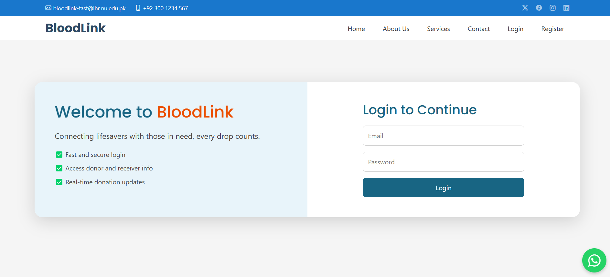
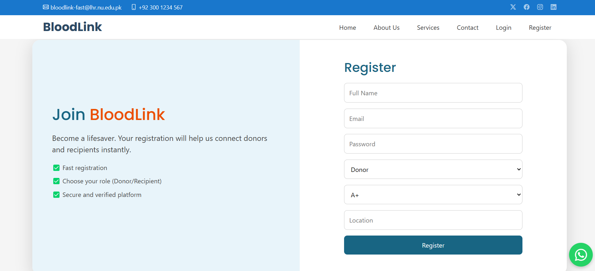
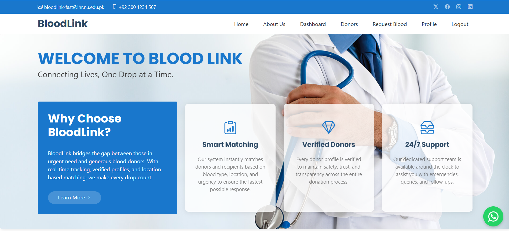
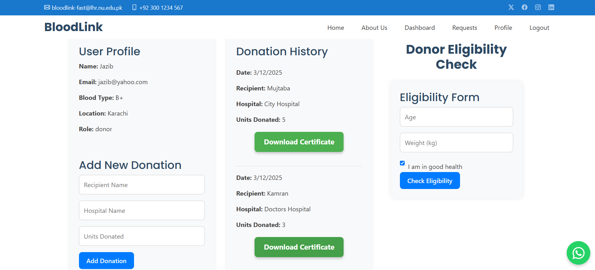

# 🩸 Blood Donation Web App

A full-stack web application that connects **blood donors** and **recipients**, featuring registration, donation tracking, eligibility checks, and more.

## 🚀 Tech Stack

- **Frontend**: React, CSS
- **Backend**: Node.js, Express
- **Database**: MongoDB

---

## 📦 Project Setup

### 🖥️ Frontend

1. Navigate to the `frontend` folder:
    ```bash
    cd frontend
    ```

2. Install dependencies:
    ```bash
    npm install
    ```

3. Run the frontend server:
    ```bash
    npm start
    ```

   The frontend will be accessible at: [http://localhost:3000](http://localhost:3000)

---

### 🔧 Backend

1. Navigate to the `backend` folder:
    ```bash
    cd backend
    ```

2. Install dependencies:
    ```bash
    npm install
    ```

3. Create a `.env` file in the `backend` folder and add your environment variables (e.g., MongoDB URI and JWT secret):
    ```env
    MONGO_URI=your_mongodb_connection_string
    JWT_SECRET=your_jwt_secret
    ```

4. Run the backend server:
    ```bash
    npm run dev
    ```

   The backend will run on: [http://localhost:5000](http://localhost:5000)

---

## ✅ Features

- User registration and login (Donor, Recipient, Admin)
- Profile and donation history
- Blood donation eligibility checker
- Admin access to all donations
- Certificate generation for donors

---

## 📸 Screenshots

1. Login : 
2. Register : 
3. Home : 
4. Profile : 

---

## 🙌 Contributing

Pull requests are welcome. For major changes, please open an issue first to discuss what you would like to change.

---
